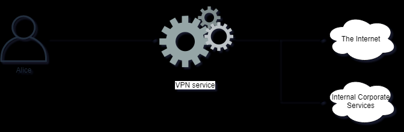
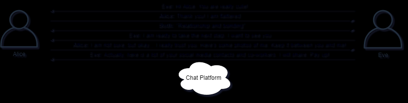
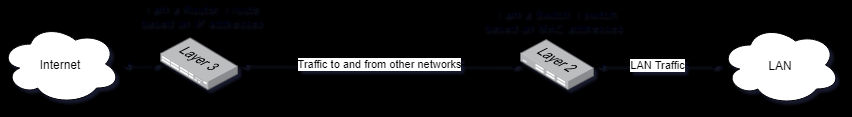
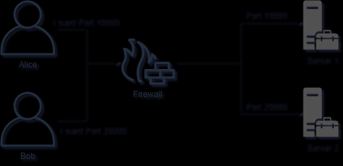

# Cyber Security Tutorial

Learning by Reading
We have created 16 tutorial pages for you to learn the fundamentals of Cyber Security:

1. Basic Cyber Security
2. Cyber Crime
3. Money Making Threats
4. Dark Web
5. Networking Basics
6. Network Layer
7. Network Transport
8. Firewalls
9. Web Applications
10. Mapping & Port Scanning
11. Network Attacks
12. Web Application Attacks
13. WIFI Attacks
14. Passwords
15. Penetration Testing and Social Engineering
16. Security Operations
17. Incident Response

# Cyber Security **Cyber Crime**

## **Cyber Crime**

What is Cyber Crime? Just like regular crime, it also exists on the Internet. Here are some examples of Cyber Crime:

* Identity Theft
* Online Predators
* BEC ("Business Email Compromise")
* Ransomware
* Stealing of sensitive intellectual property

## Increasing Crime

Cyber Crime has been increasing regularly every year. Why is Cyber Crime on the rise? Here are some reasons:

* Cyber Crime is easy to accomplish
* Low risks of getting caught
* For little work there is often high returns
* Attackers can target thousands of victims
* Money laundering is easier with Cryptocurrencies

Challenges like identity theft can have significant consequences on an individual, causing not only the potential of financial losses but also a lot of personal grief.

The Internet offers many services to facilitate money laundering, usually making it a trivial process. As money is exchanged in cryptocurrency, services such as tumblers make it hard to track the money.

Tumblers are services which split up cryptocurrency transactions and forward the money through many accounts, with different values, for thousands of people, making them hard to track.

## Cyber Criminals

Who are Cyber Criminals? It can be anyone, but let us discuss some common ones we see in the media all the time:

* State-sponsored groups targeting organizations in other countries
* Hacking Groups out to target companies to make them pay ransom
* Kids in their rooms doing illegal hacking

**Note:** Cryptocurrency is money represented in digital form instead of physical. There are many different Cryptocurrencies, some very widespread like Bitcoin, and others smaller and unknown to most people. These currency models relies on strong cryptography and public ledger systems to keep track of transactions and how much currency is on the market.

## Catching Cyber Criminals

Cyber Criminals can stay anonymous with trivial means, and typically easy to avoid getting caught. When attackers do get caught, it is often because of mistakes made by the attackers themselves, for example as a result of becoming complacent. There is also a great deal of potential for law-enforcement to use caught cyber criminals to rat out others in the industry.

Law enforcement do, however, have many challenges in tracking down cyber-crime. You might see attack traffic coming in from a system residing in UK, and when taking down this system, you realize it was being remotely controlled by e.g. another system in India. Cooperating with law-enforcements across borders, you might be able to get to the system in India, but only to realize it was again remotely controlled through e.g. Pakistan.

# Cyber Security **Money Making Threats**

## Driven by Money

There are a few key threats organizations face frequently:

* Ransomware files and systems are encrypted with attackers keys and they demand you to pay money to get your data back.
* Cryptocurrency miners; your systems are infected with a low-profile cryptocurrency mining tool. This tool uses the CPU to try make money on a cryptocurrency for the attackers.
* BEC ("Business Email Compromise"). Users get hacked through all sorts of methods and their emails are compromised. Via email compromise the attackers can intercept communications, for example an invoice, and try to redirect payments to other banks and accounts.

There are plenty of ways of making money for cyber criminals, which attracts people and interest.

## Value and Power

There is value and power in many things related to IT, for example:

* Bandwidth can be used to pressure businesses by targeting them with DDOS ("Distributed Denial of Service") attacks.
* Hacked systems may have sensitive information worth money, for example business proprietary information, online gaming assets, sensitive photographs and pictures.
* Attackers can install themselves in browsers and try to hijack the online banking use.

The potential for criminals to make significant amounts of money within the cyber domain causes more and more criminal gangs and other opportunists to join in on the action and make our lives much harder.

## Threatening for Money

Another common attack cyber criminals perform to make money is the act of extortion, that is holding individuals hostage based on information they have on a individual, trying to make them pay money to be released from the extortion attempt. Consider the following common scenario:

* A person meets up with someone online, the other party is actually a scam artists trying to trick the victim.
* They engage in interesting conversations and seem to make an immediate deep bond between one another.
* They might even engage in video conversations, but the scam artists is for example using recorded video or simply has an excuse for not being able to activate their microphone or web-camera.
* One thing might lead to another and the relationship could turn sexual. The scam artist tries to convince the victim in giving up personal pictures and recordings of themselves, likely in compromising situations.
* Once the scam artist receives this material, perhaps even returning fake pictures of innocent people in similar situations, the extortion begins.
* The scam artist can now threaten to release the compromising material to family members, co-workers and others, offering to delete the material if a sum of money is paid into the scam artists account.

# Cyber Security **Dark Web**

## The Dark Web

The Dark Web(also called The Dark Net) is a network within the Internet which is only accessible using certain software and protocols.

The Dark Web has many names, for example *Tor Network* or  *Onion Router* .

Anyone can access to the Dark Web by simply downloading software for it. A popular and very much used browser is the Tor Project's Tor Browser

This is just like any other browser such as Google Chrome or Microsoft Edge, except it can also access special website addresses which ends in .onion instead of .com and such.

Any traffic sent through Tor Browser is automatically anonymized and encrypted via many different hosts. The browser also has built-in protection for many kinds of tracking and de-anonymization features.

## Accessing The Dark Web

You can access many fun and interesting websites through this browser, also many which co-exist on the regular Internet. For example if you access the following URL's in Tor Browser, your communications will be fully encrypted and anonymized inside the Dark Web:

* Facebook - http://www.facebookcorewwwi.onion/
* DuckDuckGo Search Engine - http://3g2upl4pq6kufc4m.onion/
* The American CIA ("Central Intelligence Agency") - http://ciadotgov4sjwlzihbbgxnqg3xiyrg7so2r2o3lt5wz5ypk4sxyjstad.onion
* The Hidden Wiki, a collection of links and places to explore - http://zqktlwiuavvvqqt4ybvgvi7tyo4hjl5xgfuvpdf6otjiycgwqbym2qad.onion/wiki/index.php/Main_Page

Because of the built-in anonymizing features and encryption, the Dark Net is also host of many criminal websites, marketplaces and networks.

**Note** : Please take care when navigating the Dark Net. The links above will only work when using the appropriate software.

# Cyber Security **Networking Basics**

## Protocols and Networking

It is essential for Cyber Security Professionals to have a solid understanding of how computers communicate. There is much more happening behind the scenes of computer networks than what can be observed when using applications.

## The OSI Model

The OSI ("Open Systems Interconnection") model represents an easy and intuitive way to standardize the different parts required to communicate across networks.

The model makes it clear what is required to communicate on a network by splitting the requirements into multiple layers.

This is what the OSI Model looks like:

| 7 - Application   | Where humans process data and information                     |
| :---------------- | :------------------------------------------------------------ |
| 6 - Presentation  | Ensures data is in a usable format                            |
| 5 - Session       | Capable of maintaining connections                            |
| 4 - Transport     | Data is forwarded to a service capable of handling requests   |
| 3 - Network Layer | Responsible for which path packets should travel on a network |
| 2 - Data Link     | Responsible for which physical devices packets should go to   |
| 1 - Physical      | The physical infrastructure to transport data                 |

The top 3 layers are typically implemented in software within the Operating System:

| Layer            | Where it is implemented |
| ---------------- | ----------------------- |
| 7 - Application  | Software                |
| 6 - Presentation | Software                |
| 5 - Session      | Software                |

The bottom 3 layers are typically implemented in hardware within devices on the network, e.g. Switches, Routers and Firewalls:

| Layer             | Where it is implemented |
| ----------------- | ----------------------- |
| 3 - Network Layer | Hardware                |
| 2 - Data Link     | Hardware                |
| 1 - Physical      | Hardware                |

Layer 4, the Transport layer, connects the software with the hardware layers.

SDN ("Software Defined Networking") is technology which allows more layers of the hardware to be implemented via software.

## Layer 7 - Application Layer

The business logic and functionality of the application lies here. This is what the users use to interact with services across a network. Most developers create applications on the Application Layer.

Most of the applications you use are on the Application Layer, with the complexity of the other layers hidden.

Examples of Layer 7 Applications:

* HTTP ("Hypertext Transfer Protocol") - Enables us to access web applications
* FTP ("File Transfer Protocol") - Allows users to transfer files
* SNMP ("Simple Network Management Protocol") - Protocol to read and update network device configurations

There are many applications which uses these protocols like Google Chrome, Microsoft Skype and FileZilla.

## Layer 6 - Presentation Layer

Typically an unseen layer, but is responsible of adapting, transforming and translating data. This is to ensure the application and layers beneath can understand one another.

* Encoding Schemes used to represent text and data, for example ASCII(American Standard Code for Information Interchange) and UTF(Unicode Transformation Format).
* Encryption for services, for example SSL ("Secure Sockets Layer") and TLS ("Transport Security Layer")
* Compression, for example GZip in use in many implementations of HTTP.

## Layer 5 - Session Layer

 This layer's responsibility is handling connections between the application and the layers below. It involves establishing, maintaining and terminating connections, otherwise referred to as sessions.

Common protocols which represent the Session Layer well are:

* SOCKS - A protocol for sending packets through a proxy server.
* NetBIOS - An older Windows protocol for establishing sessions and resolving names.
* SIP ("Session Initiation Protocol") - For engaging in VOIP ("Voice Over IP") communications

## Layer 4 - Transport

The layer which allows applications to be represented on the network.

Some well known applications on this layer:

* TCP ("Transmission Control Protocol") - Used for many applications, ensuring stability, control of how much data can be sent at any given time, reliability and more.
* UDP ("User Datagram Protocol") - Lightweight and quick protocol use for many services.
* QUIC ("Quick UDP Internet Connections") - A protocol designed for faster connections and goes hand-in-hand with the version 2 of the HTTP protocol.

## Layer 3 - Network

A layer responsible of routing packets between networks via routers.

On this layer, the following protocols reside:

* IP ("Internet Protocol") - Used everyday when accessing the Internet. Comes in two versions, IP version 4 and 6.
* ICMP ("Internet Control Message Protocol") - Used by network devices and network operators, to diagnose network connections or for devices to send and respond to error conditions and more.
* IPSec ("Internet Protocol Security") - Allows encrypted and secure connections between two network devices.

## Layer 2 - Link

Link networks, as the name implies, consist of protocols designed to send packets through the actual links (physical connections) that network nodes are connected to. A simpler way of thinking of it is that the Link Layer is responsible for moving data from physical over to logical (to the network layer).

Protocols on this layer include:

* Ethernet - An essential protocol used by most operating systems when connecting to networks using a physical cable.
* Wi-Fi ("Wireless Fidelity") - For accessing networks via radio signals. It uses a family of protocols called IEEE 802.11.xx
* NDP ("Neighbor Discovery Protocol") - IP version 6(IPv6) uses this protocol on the Link Layer to gather information required to communicate via IPv6

## Layer 1 - Physical

Physical layer represents the signaling which allows bits and bytes to transfer between a physical medium. It can be transferred via radio or signals over a cable, using electrical signals or light, for example fiber.

Examples of the Physical Layer protocols includes:

* CAN Bus ("Controller Area Network") - Used in microcontrollers and other devices to communicate to other similar devices, not involving a computer. Often used in ICS ("Industrial Control Systems").
* Ethernet Physical Layer - Used by Ethernet on the physical layer to send signals with speeds up to many gigabits of traffic per second.
* Bluetooth Physical Layer - Bluetooth also has its own specifications on how radio signals should be sent and received.

# Cyber Security **In-Depth Network Layer**

## IP - The Internet Protocol

IP is used to communicate across networks, not just across physical links, but between networks of routers. The addressing scheme in use is either IPv4 ("IP Version 4") or IPv6 ("IP Version 6").

IP networks can be broken into different sections, often called subnets. This is accomplished by adding an extra piece of information, together with the IP address, called a  *netmask* . The netmask dictates how large a network is and which packet is routed within the network and which should be routed outside of the network.

Netmasks can be represented via decimal numbers or with a slash notation.  When using slash notation, the slash follows the systems IP address. Here are some examples:

| **IP Address** | **Slash Notation**      | **Netmask** |
| -------------------- | ----------------------------- | ----------------- |
| 10.0.0.1             | /8   - Example: 10.0.0.1/8    | 255.0.0.0         |
| 172.16.1.1           | /12 - Example: 172.16.1.1/12  | 255.240.0.0       |
| 192.168.0.1          | /16 - Example: 192.168.0.1/16 | 255.255.0.0       |
| 192.168.0.1          | /24 - Example: 192.168.0.1/24 | 255.255.255.0     |

Some IP networks are reserved for only a certain kind of traffic. The IP addresses in the table above are reserved for only internal organizational use, meaning they should not be routed on the Internet. These kinds of IP addresses are commonly referred to as RFC1918 addresses.

## Different Networks

Let us take a look at different networks within RFC1918 and how large the networks are:

* 10.0.0.0/8 - More than 16 million IP addresses
* 172.16.0.0/12 - About 1 million IP addresses
* 192.168.0.0/16 - 65534 IP addresses

IP segments can be further broken up into smaller and more granular networks.

Each network has a reserved address for broadcasting traffic to every host in the network, this is called the broadcast address. Broadcasting data means sending data to everyone on the network instead of sending to just a single host. There are many applications and protocols which rely on broadcasting traffic in order for them to work.

For each network segment the broadcast is always last IP address in the network. For example in the network 192.168.0.0/24 network, the broadcast address is 192.168.0.255.

The smallest netmask possible is 255.255.255.255, represented as /32. This network only has one IP address.

If traffic needs to be sent back to the host, e.g. for communications between applications, it is sent to the localhost address. This address is always 127.0.0.1 and is a /8 network.

In IP networks the traffic is routed by a router. A router is a networking device which understands the IP format and can forward packets between networks. This is different than a switch as the switch forwards data within a network, while the router forwards between networks.

Packets on the network has headers which describe many of the important details we already discussed within the IP protocol. IPv4 Header looks like this:

*Image Credits: By Michel Bakni - Postel, J. (September 1981) RFC 791, Internet Protocol, DARPA Internet Program Protocol Specification, The Internet Society, p. 11 DOI: 10.17487/RFC0791., CC BY-SA 4.0, [https://commons.wikimedia.org/w/index.php?curid=79949694](https://commons.wikimedia.org/w/index.php?curid=79949694)*

The Source Address is the IP address of the system who is sending the packet, and destination is to whom the packet is intended. There are also other fields in the header which is used by the many features of the IP protocol, but which are outside the scope of this introduction class.

You can check your IP address on Windows by running the command `ipconfig` within a Command Line Window. On Linux this is done with the `ip addr show` or `ifconfig` command.

When a computer needs to communicate to something which can not be found on the LAN, it sends traffic to the default gateway as per how the system is configured. The default gateway being a router which is capable of forwarding the traffic to the destination IP address.

## NAT ("Network Address Translation")

NAT allows a system accepting connections on a public IP address to map those requests to an internal RFC 1918 IP address or vice versa. Systems which do NAT'ing are typically firewalls and routers.

A typical implementation of NAT is where the external IP address is used as a front for multiple internal IP addresses, and the destination port number is used to decide which server the data should be sent to. This allows internal IP addresses to receive traffic from external systems.

Another very common implementation is allowing internal IP addresses to access the internet with an external IP address. The NAT keeps track of connections from internal to destination addresses and forwards traffic across the connections.

NAT can be configured in many ways, but in this class you we do not go into more details of the method.

**Note** : NAT allows network engineers to be more flexible with their deployments, allowing many different use-cases to unfold.

## IPv6 - IP Version 6

IP version 6 is the latest standard for IP and was made to support more IP addresses. Instead of using 32 bits of addressing for IP addresses, 128 bits is used. This allows for enough IP addresses for the foreseeable future while IPv4 has already run out.

IPv6 addresses uses 8 groups of of 4 hexadecimal numbers. An IPv6 address look like this: 2a00:1450:400f:80a::200e:. Notice it does not have have the 8 groups of 4 hexadecimal numbers. This is because IPv6 addresses can be shortened via simple rules:

* Leading 0's can be shortened
* Double colon (::) can be used to represent a continuous string of 0's.

The expanded IPv6 address is: 2a00:1450:400f:080a:0000:0000:0000:200e.

The localhost can be reduced into ::1 and ::.

IPv6 has networks, i.e. subnets, just like IPv4 has.

The IPv6 header looks like this:

We can see a much simpler header with a lot more room for IP addressing.

IPv6 is used more and more, and there is built in support for this protocol in many tools. For example with `ping` we can switch between IPv4 and IPv6 with the -4 and -6 flag respectively.

Run `ipconfig` and see if you see any IPv6 addresses. If you have IPv6 enabled, try `ping -6 google.com` and `ping -4 google.com`. See how the command allows us to use either IPv4 or IPv6?

Note: If you do not have IPv6 today, there are many public cloud services which will grant you a public IPv6 address today which you can use to experiment and explore with.

## ICMP

ICMP is often associated with Ping and Traceroute. ICMP can be used for other things, such as ask a node for its time referred to as an ICMP Timestamp request. An ICMP Timestamp request simply allows e.g. a Router to ask another Router to synchronize their time, an important attribute in network communications.

A common tactic for attackers to check if systems are available on a network, is to conduct a Ping Sweep. The goal of such activity is to make the target device in a network range reply to ping requests so that the attacker knows it is available. This approach is naive as many systems by default block incoming pings.

## Traceroute

Tracerouting is a way to determine which routers are involved in sending a packet from system A to B. Knowing which routers our packets take can be useful both better understanding our networks and also in understanding the attack surface. A router is responsible for routing the package in the right direction. Imagine this as driving on a road, where road signs at intersections guide you to the destination. These signs at intersections  represent routers. Traceroute identify these signs and intersections and tells you how far away they are, measured in milliseconds (ms).

The IPv4 TTL and IPv6 Hop Limit headers have the same function. Every router who routes a packet will decrement this value by 1, and if the value reaches 0 the router will discard the packet and return an ICMP Time Exceeded packet to the sender.

To perform a traceroute on Windows:

tracert google.com

To perform a traceroute on Linux (not installed by default):

traceroute google.com

The process of tracerouting via these tools is simple:

1. The operating system sends a packet google.com, the TTL value is set to 1.
2. The packet is routed on the network, and the first router decrements the TTL by 1, leaving it at 0. This causes the router to drop the packet and send "ICMP Time Exceeded" back to the source.
3. The client increases the TTL 1, allowing the packet to be routed through one additional hop.

This process is repeated, increasing the TTL with 1 until the destination has been reached.

## DNS ("Domain Name System")

DNS is used to map applications, via names, to IP addresses. For example if you want to use your browser to visit http://google.com, the browser must first make a request to a DNS server to resolve the IP address behind google.com

Systems are typically configured with a primary and secondary domain name server. These settings can be configured manually or be provided by a DHCP server. This allows our computer systems to reach a DNS server for it to resolve for us.

The DNS server is then responsible for resolving the request. It will then proceed to check its own cache to see if it already knows the answer. Each DNS answer can be cached, that is stored temporarily to speed up future requests, for a certain TTL ("Time To Live"). The TTL is typically set to a couple of minutes, for example 10 minutes.

If a DNS server does not have a answer in its cache it will then proceed to check who is responsible for giving the answer. This is done via a recursive process which involves asking a hierarchical system of name servers which inevitably will make the DNS request to end up at the Authoritative Name Server.

You can try to do a DNS lookup with Windows or Linux now. From a command line terminal on Windows type `nslookup w3schools.com` , or on Linux type `dig w3schools.com`. You should see output like this:

The IP address of w3schools.com can be seen in the *;; ANSWER SECTION.* When this screenshot was captured, the IP address behind the w3schools.com name was  *66.29.212.110* .

The Authoritative Name Server is the DNS server which is responsible for giving the definitive answer to a question. For example the IP address of google.com will be answered by their authoritative name server, and we can see this server by querying for it:

Finding authoritative name server on Windows:

nslookup -type=SOA google.com

Finding authoritative name server on Linux:

dig -t SOA google.com

## DHCP ("Dynamic Host Configuration Protocol")

As the name implies, the DHCP protocol allows any system on a network to reach out to a server and receive a configuration. Such configuration typically implies receiving IP address and network range, default gateway and DNS servers.

DHCP allows for easy management of clients joining and leaving a network.

If you are curious if you are using DHCP right now you can type `ipconfig /all` on a Windows system and look for "DHCP Enabled: Yes" in the output. Your computer might have multiple network interfaces

## VPN ("Virtual Private Network")

A VPN is a system which enables two system to establish encrypted forms for communication, enabling network traffic to be encrypted in transit. Many VPN's is a client to server architecture, allowing the client to access multiple services behind the VPN. VPN's hosted by your work place is also likely to provide access to resources otherwise only accessible from the inside.

Some VPN services are designed for user privacy and encryption for data in transit. These services enables users to send network data via the VPN, effectively masquerading the users IP address when navigating the Internet.

It is generally good practice to use VPN's to secure your network communications, however we should not use any kind of VPN service. Free VPN services can sometimes be malicious, inspecting, reading and storing your sensitive data.

